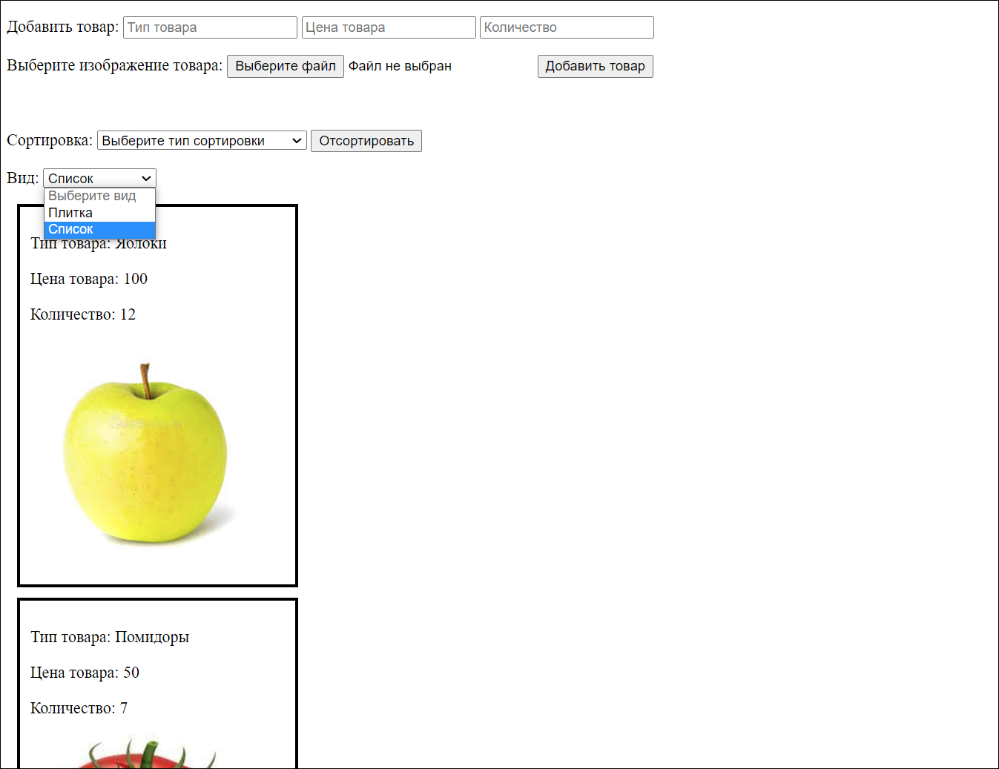

# Product list (JavaScript)
Статичная страница со списком товаров и возможностью их добавления.
  

### Ссылка на развернутый проект:
https://yarsoul.github.io/product-list-js/
  

## Пример работы приложения:

1. Начальная страница выглядит следующим образом:

    

2. Например, добавим товар:
    - Тип товара: Огурцы
    - Цена: 120
    - Количество: 1
    - Изображение не добавляем\*

    \**При добавлении товара с неуказанными полями, значения этих полей устанавливаются по умолчанию*. Например, если:
    - не указана цена, то значение цены будет равно 0;
    - не указан тип товара, то значение типа товара будет "не указан";
    - не указано кол-во товара, то значение количества будет равно 0;
    - не указано изображение товара, то появится изображение с надписью "Новый товар".

    

3. Попробуем отсортировать карточки товаров. Виды сортировок:
 - по Типу товара,
 - по Цене товара (возрастанию),
 - по Количеству товара (возрастанию).
 Для сортировки необходимо выбрать нужный тип сортировки и нажать "Остортировать". Например, выберем тип сортировки "Цена (по возрастанию)" и отсортируем:

    

4. Теперь товар отсортирован по цене.
5. Также есть возможность менять вид отображения карточек товаров. Типы видов отображения:
- Плитка - карточки товаров отображаются встроку по ширине (вид по умолчанию),
- Список - карточки товаров отображаются вертикальным списком по 1 штуке в ширину.
    При нажатии на любой из выбранных типов, выводится диалоговое окно с подтверждением:

    

    После подтверждения изменяется вид отображения карточек:

    

6. Можете попробовать сами!

